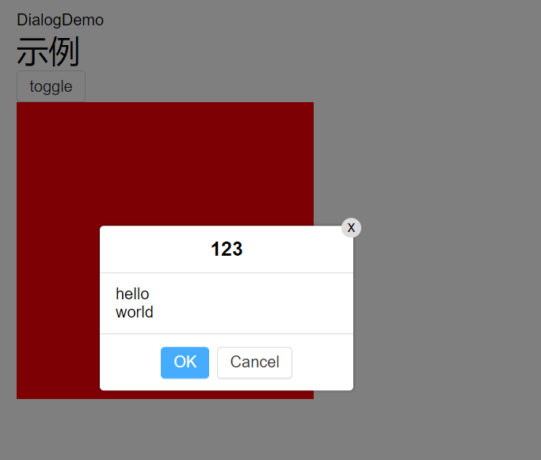
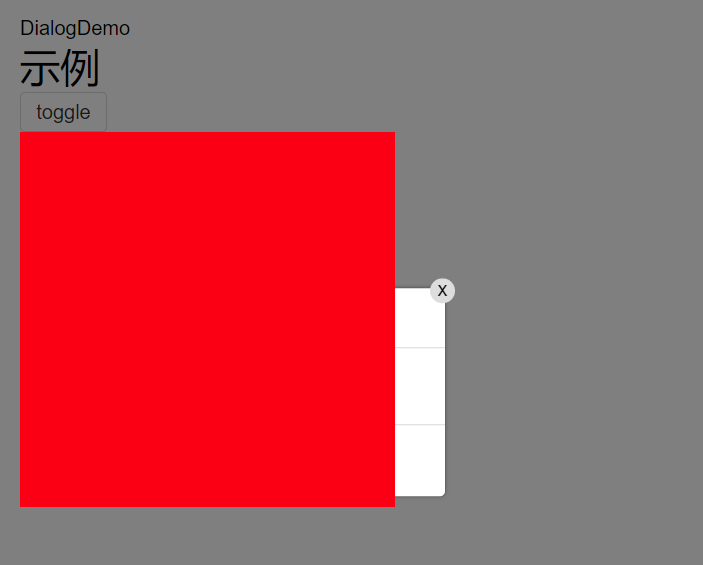

### Teleport标签
* <Teleport to="body"></Teleport>等于传送门 to传送到body下面
~~~vue
<template>
  <Teleport to="body">
    <template v-if="visible">
      

      

        

          <header>
            <slot name="title"/>
            

              x
            

          </header>
          <main>
            <slot name="content"/>
          </main>
          <footer>
            <Button level="main" @click="ok">OK</Button>
            <Button @click="cancel">Cancel</Button>
          </footer>
        

      

    </template>
  </Teleport>

</template>
~~~
~~~vue
<template>
  
DialogDemo

  <h1>示例</h1>
  

    <Button @click="toggle">toggle</Button>
    <Dialog v-model:visible="x"
            :onClickOverlay="false"
            :ok="f1"
            :cancel="f2"
    >
      <template v-slot:title>
        <strong>123</strong>
      </template>
      <template v-slot:content>
        
hello

        
world

      </template>
    </Dialog>
  

  

</template>
~~~
* 传送到body下面不受原本的层级困扰

  * 如果不传送到body下面则为这种效果
  