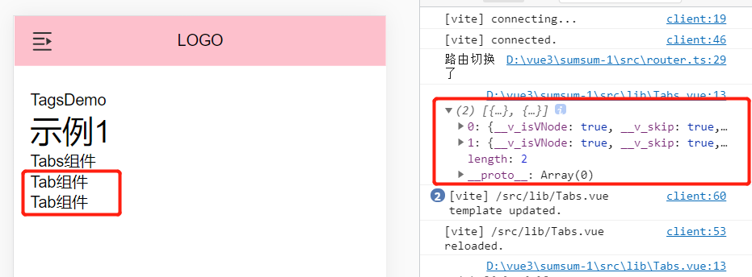
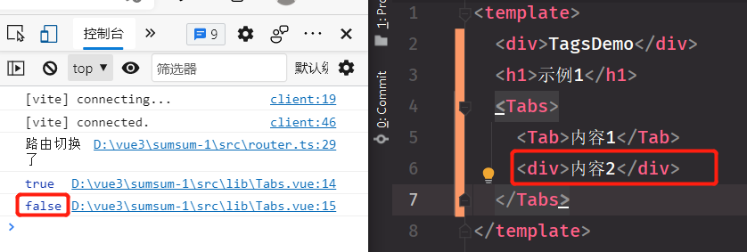

### Context

Context 传递给 setup 函数的第二个参数是 context。context 是一个普通的 JavaScript 对象，它暴露组件的三个 property：

~~~vue
// MyBook.vue

export default {
setup(props, context) {
// Attribute (非响应式对象)
console.log(context.attrs)

// 插槽 (非响应式对象)
console.log(context.slots)

// 触发事件 (方法)
console.log(context.emit)
}
}
~~~

### context.slots.default()确认运行时子组件的类型
~~~vue
//  TagsDemo

<template>
  
TagsDemo

  <h1>示例1</h1>
  <Tabs>
    <Tab>内容1</Tab>
    <Tab>内容2</Tab>
  </Tabs>
</template>
~~~
~~~vue
// Tab
<template>
  

    Tab组件
  

</template>
~~~
~~~vue
// Tags
<template>
  

    Tabs组件
    <component :is="defaults[0]"/>
    <component :is="defaults[1]"/>
  

</template>

~~~
* context.slots.default() log出来显示除一个数组，长度为2。
对应Tags组件里面有两个Tag组件
~~~vue 
  <component :is="defaults[0]"/>
~~~
* 可以把Tag组件里面的内容展示是出来

  
### 用 defaults[0].type来判断子组件的类型
~~~vue

~~~
