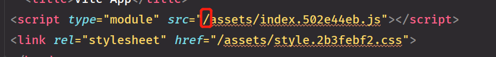

### vue3如何部署到GitHub
1. 在vite.config.ts添加
* 因为vite搭建的assets目录默认为_assets,github会忽略_开头的文件
* yarn build 后生成的dist目录路径是这样的，需要修改为./

~~~ts
export default {
    assetsDir:'assets',
    base:'./',
}
~~~

2. 在.ignore文件中添加
~~~
/dist
~~~

3. 在GitHub创建新仓库，然后上传
~~~
cd dist
git add .
git commit -m "first commit"
git branch -M master
git remote add origin 以git@开头的仓库地址
git push -f -u origin master 
~~~
